# SaheliDigitalStudio

### Working Links for the Project

Web Application hosted on Azure -> [Saheli Digital Studio](https://saheli-digital-studio.azurewebsites.net/)

Github Repository -> https://github.com/swapnilpawar974/SaheliDigitalStudio

Project Documentation With Project Video-> [Guide](https://drive.google.com/drive/folders/1qejoXr2uFto9ytSFhtZuB0Bbe-Y-tGp_?usp=sharing)

# Project Aim

The Aim of the "Saheli Digital Studio" project is to revolutionize the way photography studios 
interact with their clients by levaraging modern technology such as Azure services like Ai ChatBot, 
Azure Web App and much more which when incorporated to the project alleviates the load on the developer 
as well as creates a project which is user friendly and reliable. The primary goal is to streamline the  
reservation process for photo-shoot sessions and offer a seamless experience for ordering customized 
products. By developing a intuitive online platform, the platform aims to enhanace customer satisfaction, 
improve operational efficiency, and drive business growth for the photography studio. 

# Azure Services Used

1.Azure app service (To create and host the website online) 
2.Azure SQL Database Sevice (To Store the data into an SQL database) 
3.Azure AI Service (An ai service(chatbot) integrated into the website) 
4.Azure BackUp Service (To create a Backup of our Web App) 
5.Azure Storage service(To store backup files) 

# Web Tecnologies Used

1.HTML 
2.CSS 
3.JavaScript 
4.PHP 
5.MySQl 

# Resource Visualizer

# Azure Resources Overview

App Service:
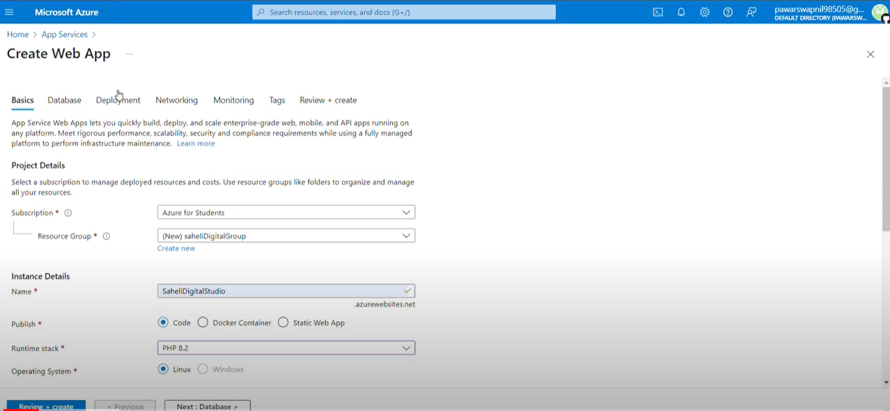

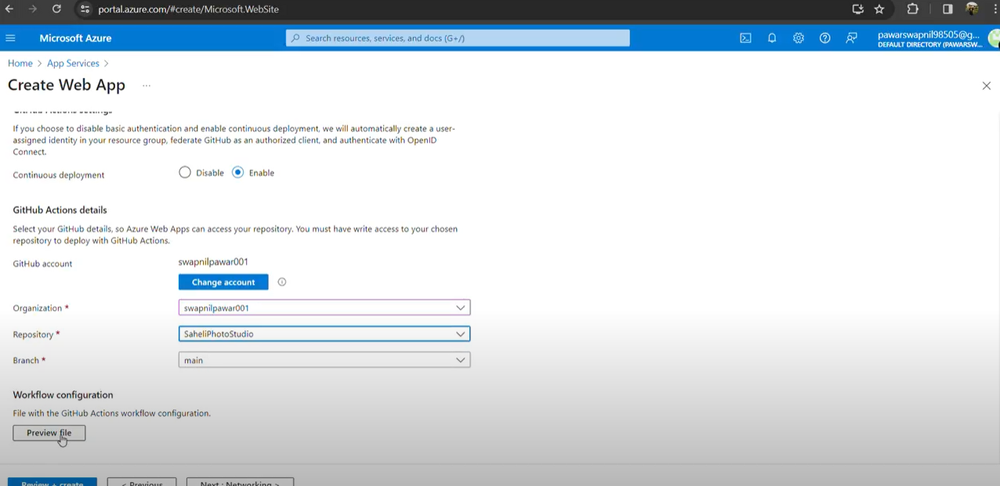

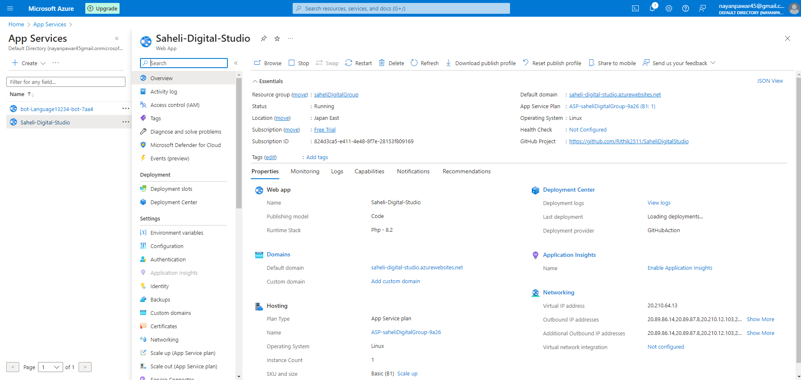

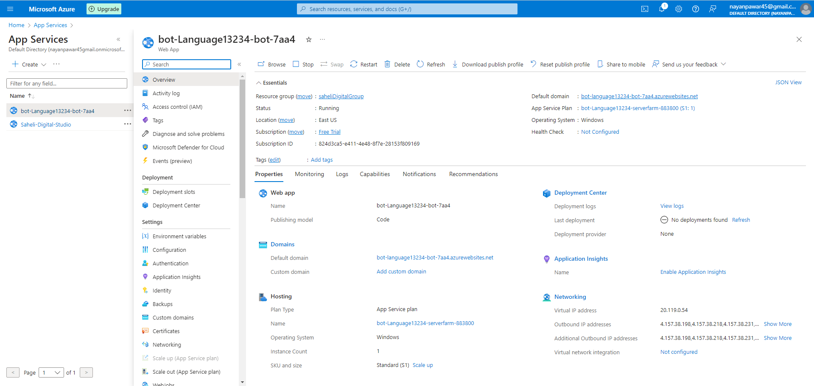

Database:
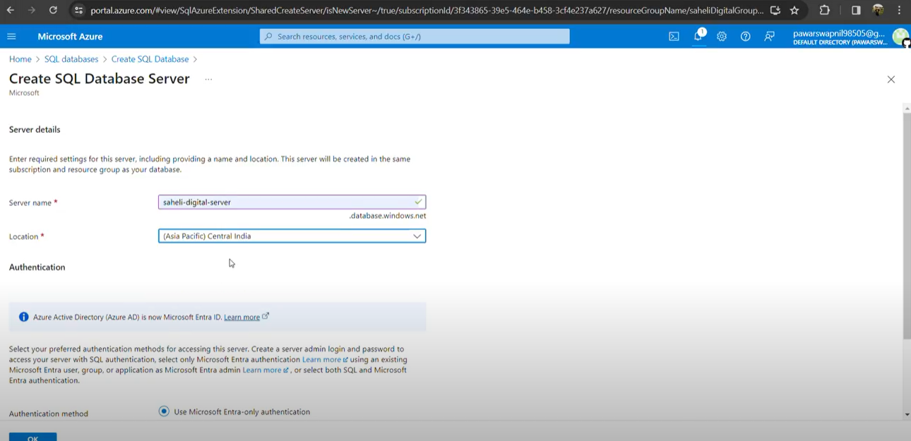
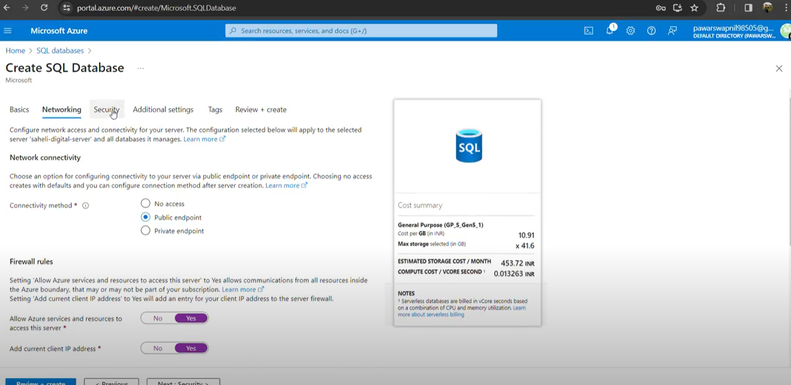

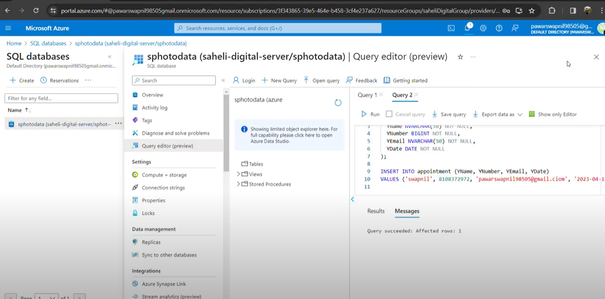

Azure AI Service:
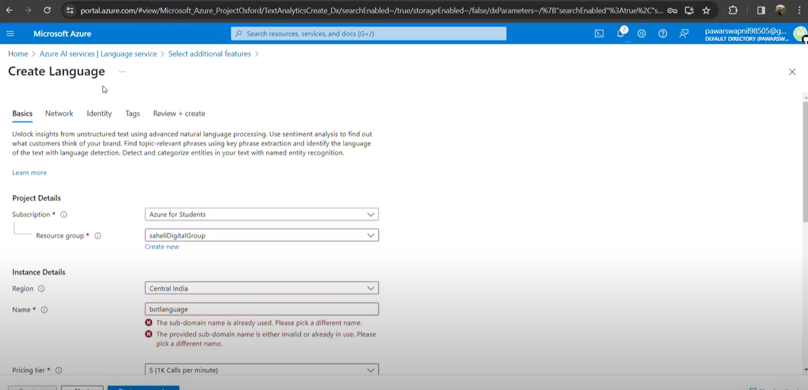
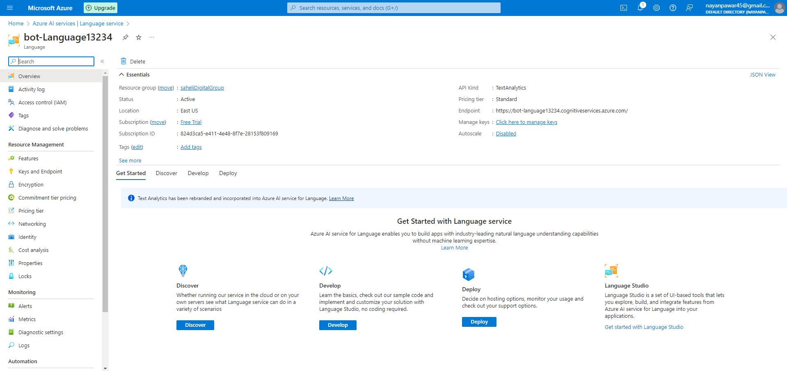

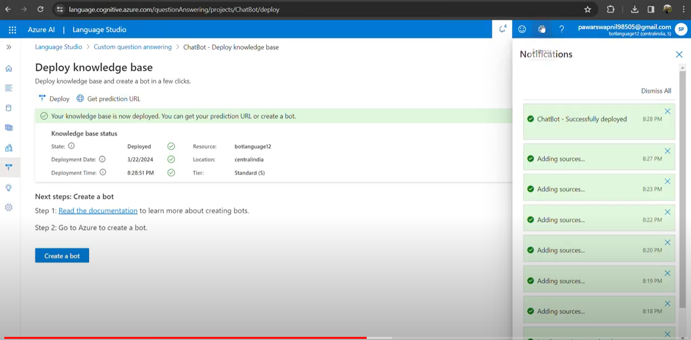
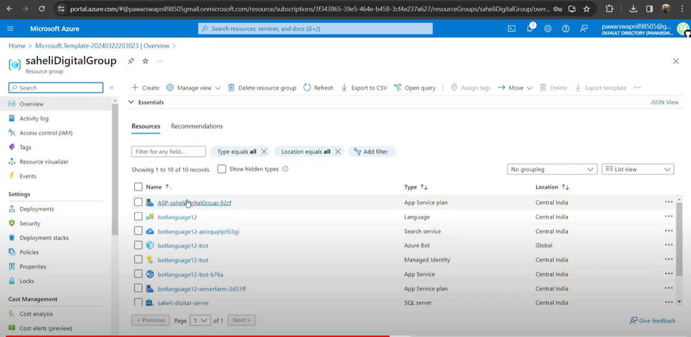

# WebSite Preview

This is the Saheli Digital Studio Project created for internship purposes. 

