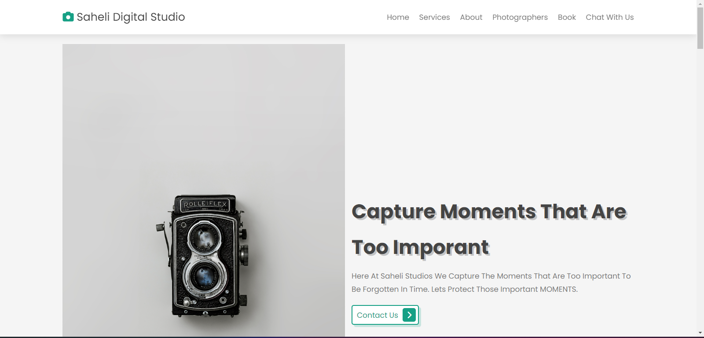
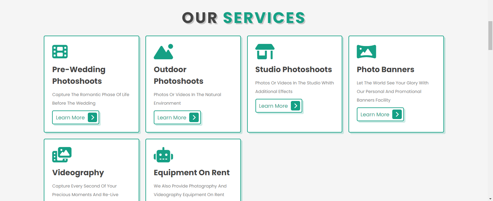
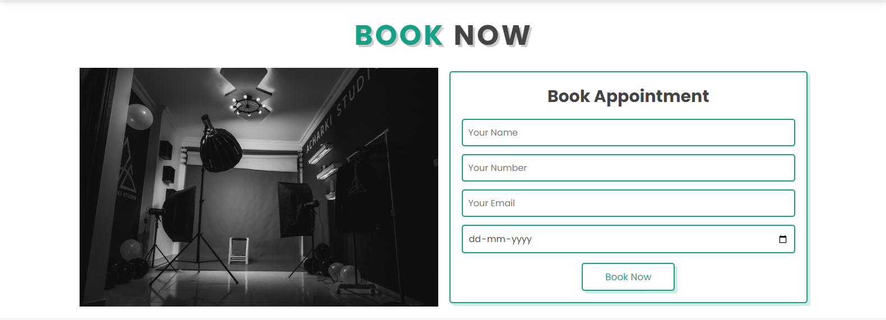
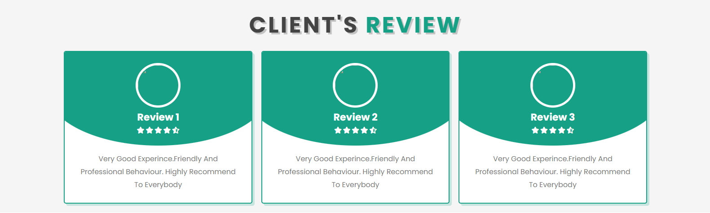
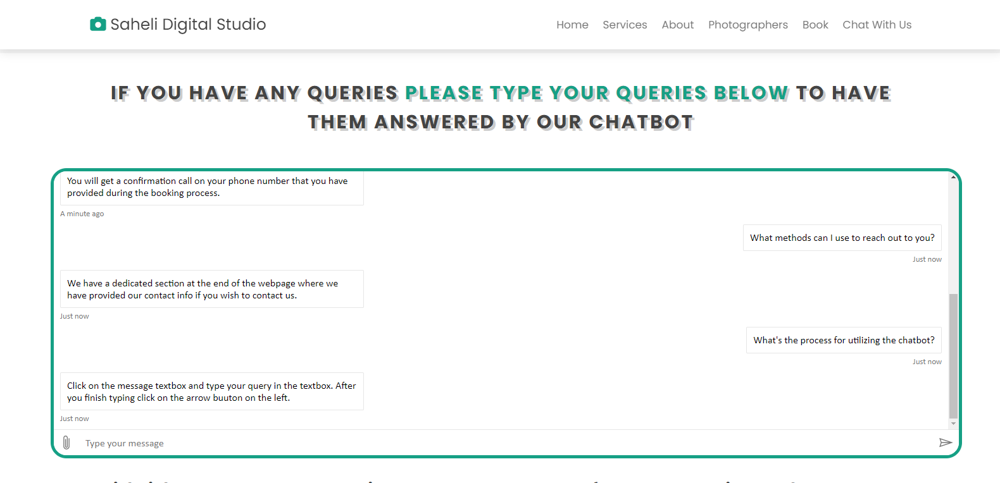
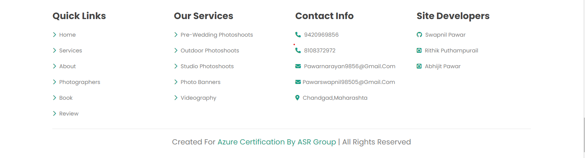

# SaheliDigitalStudio

# Project Aim

The Purpose of the "Saheli Digital Studio" project is to revolutionize the way photography studios interact with their 
clients by levaraging modern technology. The primary goal is to stramline the reservation process for photo-shoot  
sessions and offer a seamless experience for ordering customized products. By developing a intuitive online platform, 
the platform aims to enhanace customer satisfaction, improve operational efficiency, and drive business growth for the  photography studio. 

# Azure Services Used

1.Azure WebApp  (To host the website online) 
2.Azure SQL Database Sevice (To Store the data into an SQL database) 
3.Azure AI Service (An ai service(chatbot) integrated into the website) 
4.Azure BackUp Service (Used To create a Backup of our Web App) 
5.Azure Monitoring Service(Used To detect any issues) 

# Web Tecnologies Used

1.HTML 
2.CSS 
3.JavaScript 
4.PHP 
5.MySQl 

# Resource Visualizer

# WebSite Preview

This is the Saheli Digital Studio Project created for Azure az-900 and Azure az-104 Certifications. 

